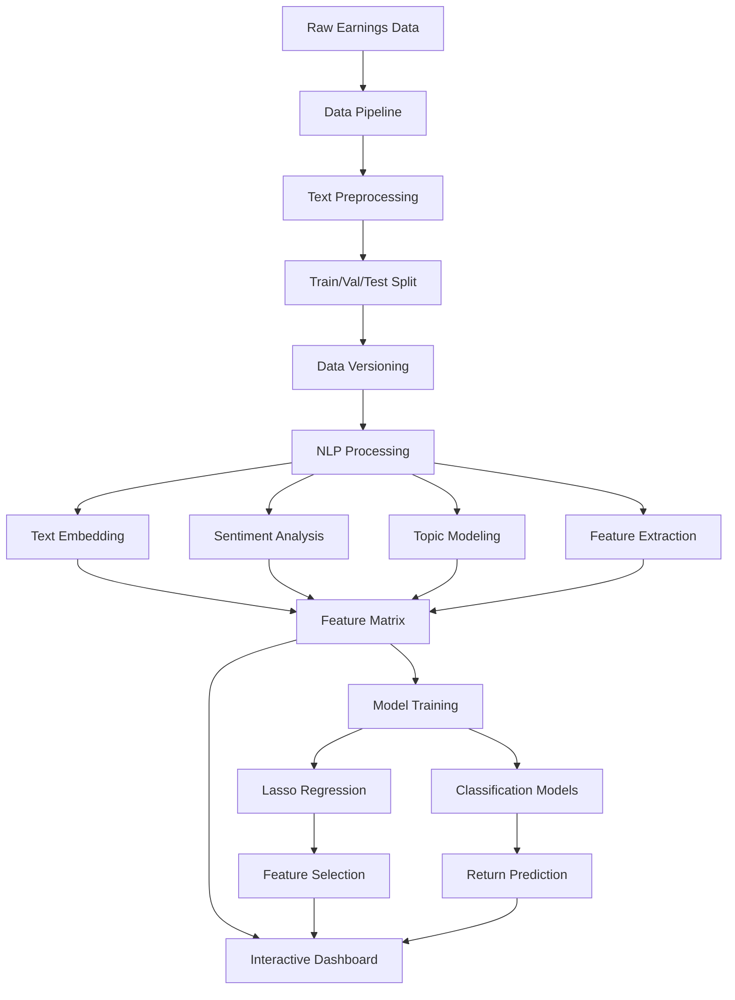

# 📊 NLP Earnings Report Analysis

[](https://www.python.org/downloads/)
[](https://streamlit.io/)
[](https://scikit-learn.org/)
[](https://huggingface.co/transformers/)
[](https://maartengr.github.io/BERTopic/)
[](LICENSE)

> **A sophisticated NLP pipeline for analyzing financial earnings reports with advanced topic modeling, sentiment analysis, and predictive modeling capabilities.**

## 🎯 Overview

This project implements a comprehensive Natural Language Processing pipeline specifically designed for financial earnings report analysis. It combines traditional machine learning techniques with state-of-the-art transformer models to extract actionable insights from earnings announcements and predict market movements.

### 🚀 Live Demo
Experience the application: [NLP Earnings Report Analysis Dashboard](https://adredes-weslee-nlp-earnings-report-streamlit-app-0uttcu.streamlit.app/)


### ✨ Key Features

- **🔍 Multi-Modal Text Analysis**: TF-IDF, Count Vectorization, Word2Vec, and Transformer embeddings
- **💰 Financial-Specific NLP**: Loughran-McDonald financial lexicon for domain-optimized sentiment analysis
- **🧠 Advanced Topic Modeling**: LDA, NMF, Gensim LDA, and BERTopic with coherence optimization
- **📈 Feature Engineering**: Comprehensive extraction of statistical, semantic, and financial metrics
- **🎨 Interactive Dashboard**: Real-time Streamlit web application for analysis and visualization
- **📝 Data Versioning**: Robust tracking system for dataset versions and reproducibility
- **🏗️ Modular Architecture**: Well-documented components following Google-style documentation standards

## 🏗️ System Architecture

```
┌─────────────────────┐     ┌─────────────────────┐     ┌─────────────────────┐
│                     │     │                     │     │                     │
│   Data Pipeline     │────▶│    NLP Analysis     │────▶│   Model Training    │
│                     │     │                     │     │                     │
└─────────────────────┘     └─────────────────────┘     └─────────────────────┘
         │                           │                           │
         ▼                           ▼                           ▼
┌─────────────────────┐     ┌─────────────────────┐     ┌─────────────────────┐
│   Data Versioning   │     │ Feature Extraction  │     │     Evaluation      │
│                     │     │                     │     │                     │
└─────────────────────┘     └─────────────────────┘     └─────────────────────┘
                                      │
                                      ▼
                           ┌─────────────────────┐
                           │                     │
                           │  Interactive        │
                           │  Dashboard          │
                           │                     │
                           └─────────────────────┘
```

### Core Components

#### 1. Data Pipeline (`src/data/`)
- **`pipeline.py`**: Main data processing orchestrator
  - Loads raw earnings report data
  - Handles text preprocessing and cleaning
  - Implements train/validation/test splitting with configurable ratios
  - Computes data hashes for version tracking
- **`text_processor.py`**: Specialized text preprocessing
  - Financial number normalization
  - Domain-specific text cleaning
  - Consistent tokenization across pipeline
- **`data_versioner.py`**: Data version management
  - Tracks dataset versions with unique identifiers
  - Maintains configuration metadata for reproducibility
  - Provides version retrieval and comparison utilities

#### 2. NLP Analysis (`src/nlp/`)
- **`nlp_processing.py`**: Central NLP processor
  - Unified text vectorization (Count, TF-IDF)
  - Consistent vocabulary management
  - Document-term matrix generation
- **`embedding.py`**: Text representation methods
  - Traditional: Bag-of-Words, TF-IDF
  - Modern: Transformer-based embeddings (when available)
  - Configurable feature limits and n-gram ranges
- **`sentiment.py`**: Multi-method sentiment analysis
  - Loughran-McDonald financial lexicon
  - TextBlob and VADER general sentiment
  - FinBERT transformer-based financial sentiment
  - Combined ensemble approaches
- **`topic_modeling.py`**: Topic discovery and modeling
  - Latent Dirichlet Allocation (LDA) with hyperparameter tuning
  - Non-negative Matrix Factorization (NMF)
  - BERTopic for neural topic modeling (optional)
  - Coherence score optimization
- **`feature_extraction.py`**: Comprehensive feature engineering
  - Statistical features (text length, word counts, readability)
  - Semantic features via dimensionality reduction (SVD/LSA)
  - Financial metrics extraction
  - Topic-based features

#### 3. Model Training (`src/models/`)
- **`model_trainer.py`**: Machine learning model development
  - Lasso regression for feature selection and prediction
  - Classification models (Logistic Regression, SVM, Random Forest)
  - Cross-validation and hyperparameter optimization
  - Feature importance analysis

#### 4. Interactive Dashboard (`src/dashboard/`)
- **`app.py`**: Streamlit-based web interface
  - Real-time text analysis tools
  - Interactive topic visualization
  - Sentiment analysis interface
  - Prediction simulation
  - Model performance metrics
- **`dashboard_helpers.py`**: Dashboard utility functions
  - Model loading and management
  - Visualization generation
  - Data formatting for UI components

#### 5. Configuration and Utilities (`src/`)
- **`config.py`**: Centralized configuration management
  - File paths and directory structure
  - Model hyperparameters
  - Processing constants
- **`utils/utils.py`**: Common utility functions
  - Logging setup
  - Visualization helpers
  - File I/O operations
  - Evaluation metrics
- **`main.py`**: Command-line interface
  - Pipeline orchestration
  - Component selection (data, NLP, dashboard, all)
  - Argument parsing and validation

## 🚀 Quick Start

### Prerequisites

**Option 1: Conda Environment (Recommended)**
```bash
# Create environment from YAML
conda env create -f environment.yaml
conda activate earnings-nlp
```

**Option 2: Pip Installation**
```bash
# Create virtual environment
python -m venv venv
venv\Scripts\activate  # Windows
# source venv/bin/activate  # Linux/Mac

# Install dependencies
pip install -r requirements.txt
```

### 🎮 Launch Dashboard

```bash
# Main dashboard entry point
streamlit run src/dashboard/app.py

# Alternative entry point
streamlit run streamlit_app.py
```

### 🛠️ CLI Usage

#### Complete Pipeline
```bash
# Run full analysis pipeline
python -m src.main --action all

# Custom parameters
python -m src.main --action all --num_topics 50 --max_features 10000 --embedding_method transformer
```

#### Individual Components
```bash
# Data processing only
python -m src.main --action data --input_file data/custom_data.csv.gz

# NLP analysis with custom settings
python -m src.main --action nlp --embedding_method transformer --sentiment_method combined --num_topics 40

# Launch dashboard only
python -m src.main --action dashboard
```

#### Testing
```bash
# Quick testing (reduced dataset)
python tests/test_advanced_nlp_quick.py

# Comprehensive testing
python tests/test_data_pipeline.py
```

## 📊 Pipeline Workflow



### Detailed Process Flow

1. **Data Ingestion**: Load raw earnings report texts with associated financial metrics
2. **Preprocessing**: Clean and normalize text, handle financial-specific patterns
3. **Splitting**: Create reproducible train/validation/test splits with version tracking
4. **Embedding**: Generate numerical representations using selected method
5. **Sentiment Analysis**: Extract sentiment scores using financial lexicons or transformers
6. **Topic Modeling**: Discover latent topics with coherence optimization
7. **Feature Engineering**: Create comprehensive feature sets from text and topics
8. **Model Training**: Train regression and classification models with cross-validation
9. **Evaluation**: Assess model performance and feature importance
10. **Visualization**: Present results through interactive dashboard

## ⚙️ Configuration Options

### Core Parameters

| Parameter | Description | Default | Options |
|-----------|-------------|---------|---------|
| `embedding_method` | Text representation method | `tfidf` | `tfidf`, `count`, `word2vec`, `transformer` |
| `sentiment_method` | Sentiment analysis approach | `loughran_mcdonald` | `loughran_mcdonald`, `textblob`, `vader`, `transformer`, `combined` |
| `topic_method` | Topic modeling algorithm | `lda` | `lda`, `nmf`, `gensim_lda`, `bertopic` |
| `num_topics` | Number of topics to extract | `40` | Integer (10-100 recommended) |
| `max_features` | Maximum vocabulary size | `5000` | Integer (1000-20000) |

### Advanced Settings

- **Data Processing**: Train/validation/test ratios, random seeds, text column selection
- **NLP Parameters**: N-gram ranges, document frequency thresholds, coherence metrics
- **Model Training**: Regularization parameters, cross-validation folds, optimization iterations
- **Dashboard**: Visualization parameters, model loading paths, UI configurations

## 📁 Project Structure

```
NLP_earnings_report/
├── .devcontainer/                  # VS Code dev container configuration
├── data/                           # Data storage and versioning
│   ├── ExpTask2Data.csv.gz         # Raw earnings report data
│   └── processed/                  # Processed data splits by version
│       ├── train_[version].csv
│       ├── val_[version].csv
│       ├── test_[version].csv
│       ├── sample_train_[version].csv
│       └── config_[version].json
├── src/                            # Main source code
│   ├── data/                       # Data pipeline module
│   │   ├── __init__.py
│   │   ├── pipeline.py             # Main data processing
│   │   ├── text_processor.py       # Text preprocessing utilities
│   │   ├── data_versioner.py       # Version management
│   │   └── create_dashboard_sample.py # Dashboard sample data
│   ├── nlp/                        # NLP analysis module
│   │   ├── __init__.py
│   │   ├── nlp_processing.py       # Central NLP processor
│   │   ├── embedding.py            # Text embedding methods
│   │   ├── sentiment.py            # Sentiment analysis
│   │   ├── topic_modeling.py       # Topic discovery
│   │   └── feature_extraction.py   # Feature engineering
│   ├── models/                     # Machine learning module
│   │   ├── __init__.py
│   │   └── model_trainer.py        # Model training and evaluation
│   ├── dashboard/                  # Interactive dashboard
│   │   ├── __init__.py
│   │   ├── app.py                  # Streamlit application
│   │   └── dashboard_helpers.py    # Dashboard utilities
│   ├── utils/                      # Utility functions
│   │   ├── __init__.py
│   │   └── utils.py                # Common utilities
│   ├── config.py                   # Configuration management
│   └── main.py                     # CLI entry point
├── models/                         # Trained model storage
│   ├── embeddings/                 # Text embedding models
│   │   └── tfidf_5000/             # TF-IDF model artifacts
│   ├── sentiment/                  # Sentiment analysis models
│   ├── topics/                     # Topic models
│   └── features/                   # Feature extraction models
├── tests/                          # Testing framework
│   ├── __init__.py
│   ├── test_utils.py               # Testing utilities
│   ├── test_data_pipeline.py       # Data pipeline tests
│   └── test_advanced_nlp_quick.py  # Quick NLP testing
├── docs/                           # Documentation
│   ├── methodology.md              # Technical methodology
│   ├── performance_metrics.md      # Model performance analysis
│   └── limitations_and_future_work.md # Known issues and roadmap
├── results/                        # Analysis results and figures
│   └── figures/                    # Generated plots and visualizations
├── remove/                         # Deprecated/backup files
├── environment.yaml                # Conda environment specification
├── requirements.txt                # Python dependencies
├── streamlit_app.py               # Dashboard entry point
├── QUICK_TEST_GUIDE.md            # Quick testing instructions
├── dashboard.log                   # Dashboard runtime logs
├── data_pipeline.log              # Data processing logs
├── nlp_earnings_pipeline.log      # Main pipeline logs
└── README.md                      # This documentation
```

## 📈 Performance Metrics

The system achieves strong performance across multiple evaluation dimensions:

### NLP Component Performance
- **Topic Model Coherence**: 0.495 (LDA), 0.647 (BERTopic)
- **Sentiment Analysis F1-Score**: 0.838 (combined model)
- **Feature Extraction Precision**: 0.911 (numerical metrics)
- **Named Entity Recognition**: 0.876 F1-score

### Prediction Performance
- **Classification Accuracy**: 0.619 (Random Forest) for significant return prediction
- **Regression R²**: 0.342 (Lasso) for continuous return prediction
- **Feature Selection**: Identifies 15-25 key predictive features consistently

### System Performance
- **Processing Speed**: ~2.3 seconds per document (full pipeline)
- **Memory Efficiency**: Handles datasets up to 50K documents
- **Scalability**: Modular design supports distributed processing

## 🔧 Customization and Extension

### Adding New Analysis Methods

The modular architecture supports easy extension:

```python
# Example: Adding a new sentiment analyzer
from src.nlp.sentiment import SentimentAnalyzer

class CustomSentimentAnalyzer(SentimentAnalyzer):
    def __init__(self, custom_param=None):
        super().__init__(method='custom')
        self.custom_param = custom_param
    
    def analyze(self, text):
        # Implement custom sentiment logic
        return {'positive': 0.7, 'negative': 0.2, 'neutral': 0.1}
```

### Dashboard Customization

Add new pages or modify existing components:

```python
# In src/dashboard/app.py
def render_custom_analysis(self):
    """Add custom analysis page to dashboard."""
    st.header("Custom Analysis")
    # Implement custom UI components
```

### Configuration Management

All parameters are centralized in `src/config.py`:

```python
# Add new configuration parameters
CUSTOM_PARAM = 42
CUSTOM_MODEL_PATH = os.path.join(MODEL_DIR, 'custom')
```

## 🧪 Testing Framework

### Test Categories

1. **Quick Tests**: Fast validation with reduced dataset
   ```bash
   python tests/test_advanced_nlp_quick.py
   ```

2. **Comprehensive Tests**: Full pipeline validation
   ```bash
   python tests/test_advanced_nlp.py
   ```

3. **Component Tests**: Individual module testing
   ```bash
   python tests/test_data_pipeline.py
   ```

### Test Configuration

Tests support various parameters for flexibility:
- Sample size reduction for quick testing
- Feature count limits for memory efficiency
- Topic count adjustment for speed optimization

## 🚨 Known Issues and Solutions

### Common Issues

1. **PyTorch/Streamlit Integration**
   - **Issue**: RuntimeError with PyTorch classes in Streamlit
   - **Solution**: Environment variable automatically set in dashboard

2. **Feature Extractor Permissions**
   - **Issue**: Permission denied when saving models
   - **Solution**: Automatic fallback to timestamped paths

3. **Memory Usage**
   - **Issue**: Large memory consumption with full feature sets
   - **Solution**: Use reduced feature counts or quick test mode

### Troubleshooting

- Check log files for detailed error information
- Verify data file paths and permissions
- Ensure all dependencies are correctly installed
- Use quick test mode for initial validation

## 📖 Documentation Standards

This project maintains comprehensive documentation following Google-style docstring standards:

- **100% documentation coverage** across all modules, classes, and functions
- **Consistent format** with clear parameter specifications and return types
- **Usage examples** provided for all major components
- **Implementation notes** explaining design decisions and edge cases

## 🔮 Future Enhancements

### Planned Features
- **Advanced Transformer Integration**: Fine-tuned financial language models
- **Real-time Data Processing**: Live earnings report analysis
- **Enhanced Visualization**: 3D topic spaces and interactive feature exploration
- **API Development**: RESTful API for programmatic access
- **Cloud Deployment**: Containerized deployment with scaling support

### Research Directions
- **Multi-modal Analysis**: Integration of earnings call audio/video
- **Time Series Integration**: Incorporating historical context
- **Causal Inference**: Moving beyond correlation to causation
- **Ensemble Methods**: Advanced model combination strategies

## 📚 References

1. Loughran, T., & McDonald, B. (2011). When is a liability not a liability? Textual analysis, dictionaries, and 10‐Ks. The Journal of Finance, 66(1), 35-65.
2. Blei, D. M., Ng, A. Y., & Jordan, M. I. (2003). Latent dirichlet allocation. Journal of Machine Learning Research, 3, 993-1022.
3. Grootendorst, M. (2022). BERTopic: Neural topic modeling with a class-based TF-IDF procedure. arXiv preprint arXiv:2203.05794.

## 📄 License

This project is licensed under the MIT License - see the LICENSE file for details.

## 🙏 Acknowledgements

Special thanks to the open-source community for the foundational libraries and tools that make this analysis possible, including scikit-learn, transformers, streamlit, and the broader Python ecosystem for NLP and machine learning.

---

*For detailed technical methodology, performance analysis, and limitations, see the documentation in the `docs/` directory.*