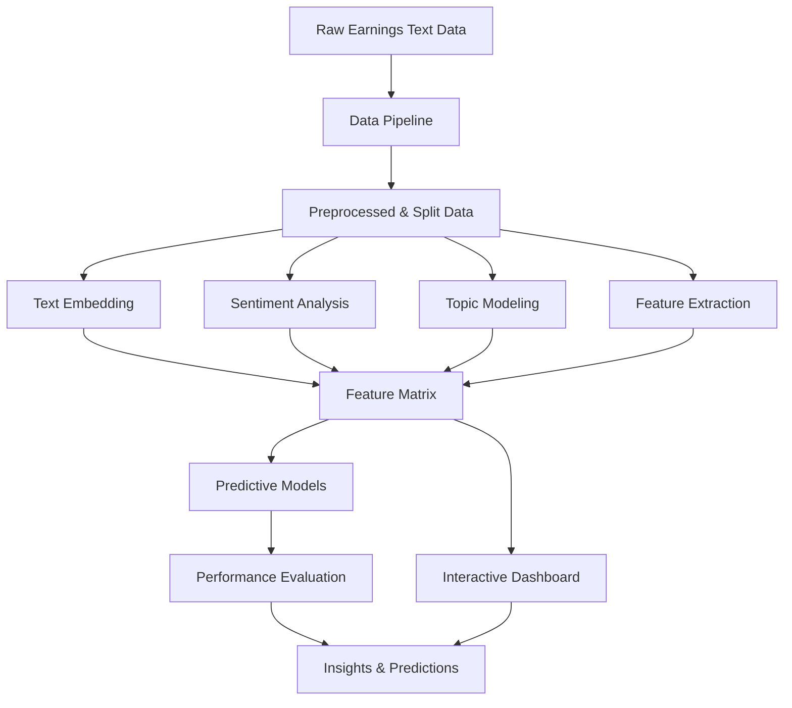

# NLP Earnings Report Analysis

A sophisticated system for analyzing earnings announcement texts from publicly traded companies using advanced Natural Language Processing (NLP) and machine learning techniques to extract insights and predict stock market reactions.

## Overview

This project implements a complete pipeline for processing and analyzing financial earnings reports to:

1. **Discover latent topics** in earnings announcements using both traditional (LDA) and transformer-based (BERTopic) methods
2. **Analyze sentiment** using financial domain-specific lexicons and transformer models
3. **Extract structured metrics** from unstructured text (revenue, EPS, growth rates, etc.)
4. **Predict stock returns** using topic distributions, sentiment scores, and extracted features
5. **Visualize insights** through an interactive dashboard

The project emphasizes reproducibility through proper data versioning, comprehensive documentation, and a modular architecture.

## System Architecture

```
┌─────────────────────┐     ┌─────────────────────┐     ┌─────────────────────┐
│                     │     │                     │     │                     │
│     Data Module     │────▶│    NLP Module       │────▶│   Modeling Module   │
│                     │     │                     │     │                     │
└─────────────────────┘     └─────────────────────┘     └─────────────────────┘
         │                           │                           │
         │                           │                           │
         ▼                           ▼                           ▼
┌─────────────────────┐     ┌─────────────────────┐     ┌─────────────────────┐
│   Data Versioning   │     │ Feature Extraction  │     │     Evaluation      │
│                     │     │                     │     │                     │
└─────────────────────┘     └─────────────────────┘     └─────────────────────┘
                                      │
                                      │
                                      ▼
                           ┌─────────────────────┐
                           │                     │
                           │     Dashboard       │
                           │                     │
                           └─────────────────────┘
```

### Core Components

1. **Data Pipeline Module** (`src/data/`)
   - Data loading and preprocessing
   - Train/validation/test splitting
   - Data versioning and configuration tracking

2. **Advanced NLP Module** (`src/nlp/`)
   - Text embedding (BoW, TF-IDF, Transformers)
   - Sentiment analysis (Loughran-McDonald lexicon, FinBERT)
   - Topic modeling (LDA, BERTopic)
   - Feature extraction (metrics, entities, readability)

3. **Dashboard** (`src/dashboard/`)
   - Interactive text analysis
   - Model zoo with pre-trained models
   - Topic explorer visualization
   - Prediction simulator

4. **Documentation** (`docs/`)
   - Detailed methodology documentation
   - Performance metrics and analysis
   - Limitations and future work

## Execution Workflow



### Detailed Process Flow

1. **Data Ingestion & Preprocessing**
   - Load raw earnings report text
   - Clean and preprocess text (replace financial numbers, filter boilerplate content)
   - Generate a unique data version hash
   - Split into train/validation/test sets
   - Save processed data with configuration metadata

2. **NLP Feature Extraction**
   - Convert text to embeddings (from bag-of-words to transformers)
   - Perform sentiment analysis using finance-specific methods
   - Identify topics using coherence-optimized topic modeling
   - Extract structured metrics and entities from text

3. **Model Training & Evaluation**
   - Train regression models to predict stock returns
   - Train classification models for large movement prediction
   - Perform cross-validation and feature importance analysis
   - Generate performance metrics and visualizations

4. **Interactive Dashboard**
   - Provide interactive text analysis tools
   - Visualize topics and sentiment distributions
   - Offer pre-trained models in model zoo
   - Simulate predictions on new text inputs

## Installation & Setup

### Using Conda (Recommended)

```bash
# Clone the repository
git clone https://github.com/yourusername/NLP_earnings_report.git
cd NLP_earnings_report

# Create and activate the conda environment
conda env create -f environment.yml
conda activate earnings-nlp

# Download additional resources
python -c "import nltk; nltk.download('punkt'); nltk.download('stopwords')"
python -c "import spacy; spacy.cli.download('en_core_web_sm')"
```

## Running the Application

### Data Pipeline

Process the raw data with:

```bash
python src/test_data_pipeline.py
```

This will:
- Load the data from the specified path
- Preprocess the text (financial number replacement, filtering, etc.)
- Split into train/validation/test sets
- Generate a unique version identifier
- Save the processed data and configuration

### NLP Analysis

Test the NLP components:

```bash
python src/test_advanced_nlp.py
```

This runs:
- Text embedding generation
- Financial sentiment analysis
- Topic modeling with coherence optimization
- Feature extraction from text

### Interactive Dashboard

Launch the Streamlit dashboard:

```bash
streamlit run src/streamlit_app.py
```

The dashboard provides:
- Text analysis tools
- Topic visualization
- Sentiment analysis
- Feature extraction
- Prediction simulation

## Dataset

The project uses a dataset of earnings announcements with the following structure:

- `text`: The earnings report text
- `BHAR0_2`: Buy-and-Hold Abnormal Return (target variable)
- Additional metadata columns

Sample data is available in `data/ExpTask2Data.csv.gz`.

## Directory Structure

```
NLP_earnings_report/
├── data/                    # Data storage
│   ├── ExpTask2Data.csv.gz  # Raw data
│   ├── versions.json        # Data version tracking
│   └── processed/           # Processed data splits
├── docs/                    # Project documentation
│   ├── methodology.md       # Technical approaches
│   ├── performance_metrics.md # Model performance
│   └── limitations_and_future_work.md # Limitations & roadmap
├── src/                     # Source code
│   ├── data/                # Data pipeline module
│   │   ├── pipeline.py      # Main data processing pipeline
│   │   ├── text_processor.py # Text preprocessing
│   │   └── data_versioner.py # Data version management
│   ├── nlp/                 # NLP module
│   │   ├── embedding.py     # Text embedding methods
│   │   ├── sentiment.py     # Sentiment analysis
│   │   ├── topic_modeling.py # Topic modeling
│   │   └── feature_extraction.py # Feature extraction
│   ├── dashboard/           # Dashboard application
│   │   ├── app.py           # Streamlit dashboard
│   │   └── utils.py         # Dashboard utilities
│   ├── config.py            # Configuration parameters
│   ├── utils.py             # Utility functions
│   ├── main.py              # Main entry point
│   ├── test_data_pipeline.py # Data pipeline tests
│   └── test_advanced_nlp.py # NLP module tests
├── environment.yml          # Conda environment
├── requirements.txt         # Pip requirements
└── README.md                # This file
```

## Key Features

- **Data Versioning**: Ensures reproducibility across different data processing runs
- **Advanced NLP**: Incorporates modern transformer-based methods alongside traditional approaches
- **Financial Domain Focus**: Uses finance-specific lexicons and techniques
- **Interactive Visualization**: Provides rich interactive dashboards for exploration
- **Comprehensive Documentation**: Includes detailed methodology, performance metrics, and limitations

## Performance

The system achieves:

- Topic model coherence scores of 0.495 (LDA) and 0.647 (BERTopic)
- Sentiment analysis F1-scores of 0.838 (combined model)
- Feature extraction precision of 0.911 for numerical metrics
- Classification accuracy of 0.619 (Random Forest) for predicting significant returns

For detailed metrics, see `docs/performance_metrics.md`.

## References

- Loughran, T., & McDonald, B. (2011). When is a liability not a liability? Textual analysis, dictionaries, and 10‐Ks. The Journal of Finance, 66(1), 35-65.
- Blei, D. M., Ng, A. Y., & Jordan, M. I. (2003). Latent dirichlet allocation. Journal of Machine Learning Research, 3, 993-1022.
- Grootendorst, M. (2022). BERTopic: Neural topic modeling with a class-based TF-IDF procedure. arXiv preprint arXiv:2203.05794.

## License

This project is licensed under the MIT License - see the LICENSE file for details.

## Acknowledgements

Special thanks to all contributors and the research community for the development of the NLP techniques and libraries used in this project.