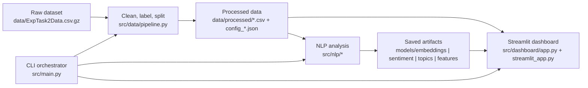

# NLP Earnings Report Analysis

Analyze earnings-report text from data/ExpTask2Data.csv.gz and tie it to market reaction via `BHAR0_2`.

Use the CLI pipeline in `src/main.py` for preprocessing and modeling, or launch the Streamlit dashboard in `src/dashboard/app.py` for exploration.

<!-- README_SURFACE_START -->

```mermaid
flowchart LR
  A["Raw dataset<br/>data/ExpTask2Data.csv.gz"] --> B["Clean, label, split<br/>src/data/pipeline.py"]
  B --> C["Processed data<br/>data/processed/*.csv + config_*.json"]
  C --> D["NLP analysis<br/>src/nlp/*"]
  D --> E["Saved artifacts<br/>models/embeddings | sentiment | topics | features"]
  C --> F["Streamlit dashboard<br/>src/dashboard/app.py + streamlit_app.py"]
  E --> F
  G["CLI orchestrator<br/>src/main.py"] --> B
  G --> D
  G --> F
```

[](https://adredes-weslee.github.io/nlp/finance/machine-learning/data-science/2025/05/09/nlp-earnings-report-analysis.html) [](https://adredes-weslee-nlp-earnings-report-streamlit-app-0uttcu.streamlit.app/)

  

## Quickstart

```bash
pip install -r requirements.txt
python -m src.main --action all
streamlit run src/dashboard/app.py
```

See [Setup and Run](#setup-and-run) for the full environment and verification path.

<!-- README_SURFACE_END -->

## Why This Repository Exists

- Turn quarterly earnings language into features that can help explain or predict post-announcement return behavior; `DataPipeline.generate_labels` uses `BHAR0_2 > 0.05` as the binary target threshold in.
- Support exploratory analysis plus regression/classification workflows for return prediction in.

## Architecture at a Glance

- src/data/pipeline.py loads raw text, cleans `ea_text` into `clean_sent`, computes `text_length`, generates `label`, splits the data, and writes versioned outputs.
- src/nlp/nlp_processing.py centralizes count/TF-IDF vectorization; src/nlp/embedding.py, src/nlp/sentiment.py, src/nlp/topic_modeling.py, and src/nlp/feature_extraction.py build embeddings, sentiment, topics, and features on top.
- src/dashboard/dashboard_helpers.py loads fixed artifacts from `models/embeddings/tfidf_5000`, `models/sentiment/loughran_mcdonald`, `models/topics/lda_model`, and `models/features/combined_features`.
- src/dashboard/app.py exposes Home, Text Analysis, Dataset Analysis, Model Zoo, Topic Explorer, Prediction Simulator, Model Performance, and About pages.

## Repository Layout

- `.devcontainer/`
- `data/`
- `docs/`
- `models/`
- `src/`
- `tests/`
- `.gitignore`
- `environment.yaml`
- `QUICK_TEST_GUIDE.md`
- `README.md`
- `requirements.txt`
- `streamlit_app.py`

## Setup and Run

1. Dependencies are pinned in environment.yaml and requirements.txt; there is no `pyproject.toml` or `setup.py`.
2. Run the dashboard with `streamlit run src/dashboard/app.py` or `streamlit run streamlit_app.py`.
3. Run the full pipeline with `python -m src.main --action all`; use `--action data` or `--action dashboard` for narrower runs.
4. `--action nlp` is safest after a version has been registered, because the repo does not check in `data/versions.json`; the from-scratch path is `--action all` or `python tests/test_data_pipeline.py` first.
5. The checkout only ships the sample processed file data/processed/sample_train_edad7fda80.csv plus data/processed/config_edad7fda80.json, not the full `train_*`/`val_*`/`test_*` trio.
6. For quick validation, use `python tests/test_advanced_nlp_quick.py --sample-size. --max-features. --num-topics.`; the helper guide is.

## Core Workflows

- Raw ingestion and split generation are handled by src/data/pipeline.py; the processed config records the versioned snapshot and split sizes.
- Model building persists artifacts under `models/` through src/main.py, src/nlp/embedding.py, src/nlp/sentiment.py, src/nlp/topic_modeling.py, and.
- The dashboard uses those artifacts plus the sample file for demos; if the sample is missing, `load_models` falls back to the most recent `train_*.csv` in.
- tests/test_data_pipeline.py is the only checked-in script that also registers a version in `data/versions.json`.

## Known Limitations

- The visible code implements `bow`/`tfidf`/`transformer`, `loughran_mcdonald`/`transformer`/`combined`, and `lda`/`nmf`/`bertopic`; modes such as `word2vec`, `textblob`, `vader`, and `gensim_lda` are not implemented in this snapshot.
- `tests/test_advanced_nlp.py` is referenced in the docs but is not present in this checkout.
- The shipped sample data has `ea_text` and `clean_sent`, while src/dashboard/app.py expects a `text` column for some sample-selection paths.
- docs/limitations_and_future_work.md limits the dataset scope to 2019-2024 and notes dashboard testing only up to 5 concurrent users.
- docs/performance_metrics.md contains numeric claims, but there is no visible benchmark runner in `tests/`; keep those numbers in a separate appendix or clearly labeled doc section.
- The repo root is missing a `LICENSE` file even though badges reference MIT.
- If you document split ratios, note that `split_data` is a two-stage split, so CLI ratios are not final proportions.
